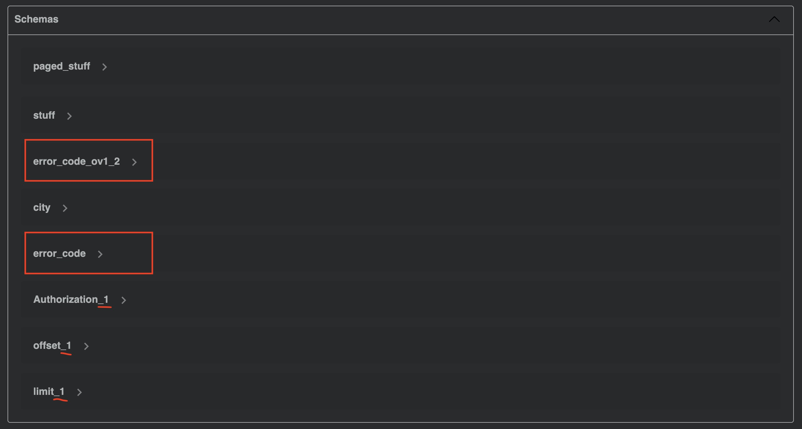

= Setup

This time the three parameters are referenced like `./shared-api-spec/components/parameters/header/{PARAMETER_NAME}/pv1.x.yaml#/{PARAMETER_NAME}`
and the `./shared-api-spec/components/parameters/header/{PARAMETER_NAME}/pv1.x.yaml` files are modified:

[cols="1a,1a"]
|===
|Header 1 |Header 2

|[source,yaml]
----
name: Authorization
in: header
description: Bearer Authorization Token
schema:
  type: string
required: true
x-parameter-version: 1.2
x-parameter-model: true
----
|[source,yaml]
----
Authorization:
  name: Authorization
  in: header
  description: Bearer Authorization Token
  schema:
    type: string
  required: true
  x-parameter-version: 1.2
  x-parameter-model: true
----
|===

[source]
----
open-api.yaml
|-- ./shared-api-spec/attributes/city/ov1.3.yaml
|-- ./shared-api-spec/components/parameters/header/Authorization/pv1.2.yaml#/Authorization
|-- ./shared-api-spec/components/parameters/query/limit/pv1.2.yaml#/limit
|-- ./shared-api-spec/components/parameters/query/offset/pv1.2.yaml#/offset
`-- ./shared-api-spec/components/schemas/error_code/ov1.2.yaml
----

== Build

[source,bash]
----
./mvnw clean compile
----

== Results

=== Positive

* This setup will be rendered correctly in VS Code using 42Crunch.vscode-openapi plugin
* openapi-generator maven plugin will successfully validate the api
* openapi-generator maven plugin will create all the files I want
* redocly lint will successfully validate the api (`npm install && npm test`)

=== Negative

* openapi-generator maven plugin will create a duplicated class:
see `./target/generated-sources/openapi/src/main/java/api/model/ErrorCodeOv12DTO.java`
vs. `./target/generated-sources/openapi/src/main/java/api/model/Ov12DTO.java`
* This setup will not be rendered correctly in IntelliJ ultimate +

