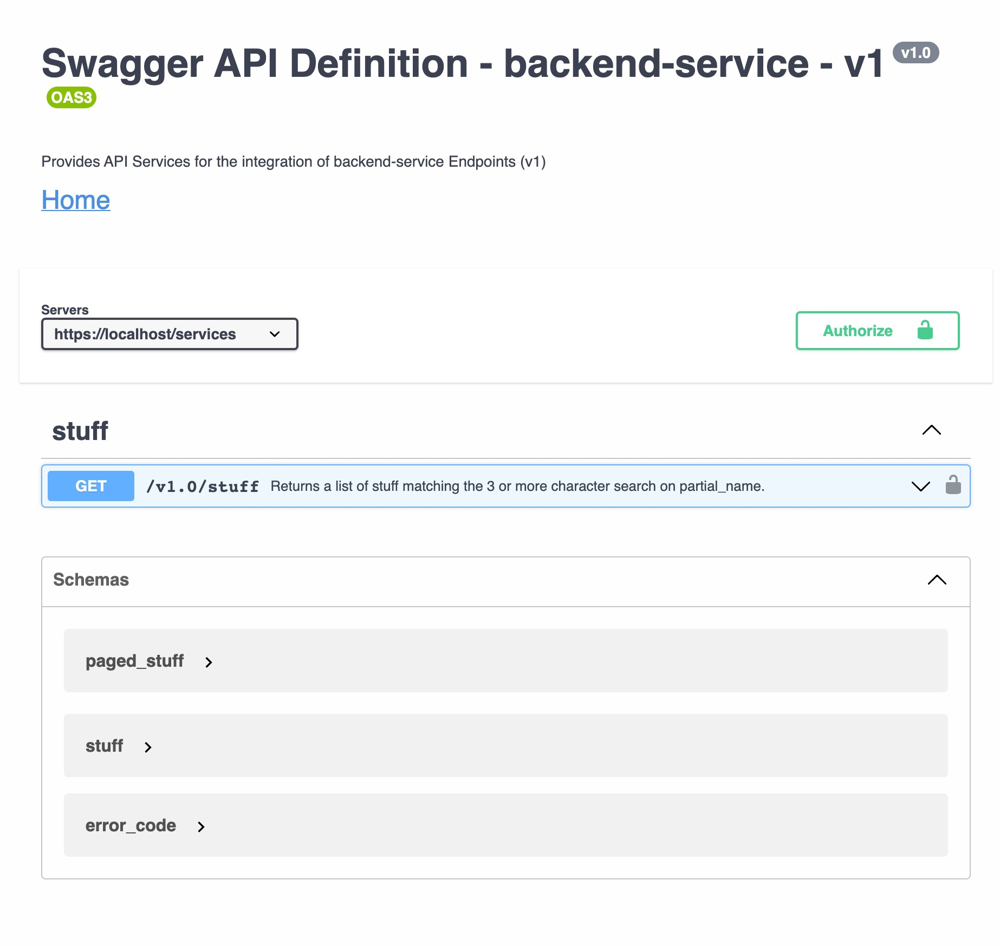
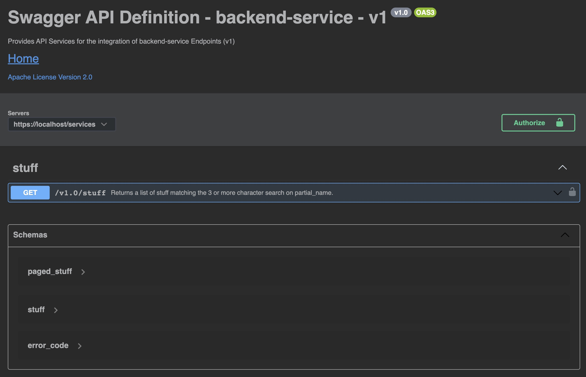

= Setup

There is one open-api.yaml file that contains all four parameters, two schemas and one special attribute.

[source]
----
open-api.yaml
----

== Build

[source,bash]
----
./mvnw clean compile
----

== Results

=== Positive

* This setup will be rendered correctly in VS Code using 42Crunch.vscode-openapi plugin

* swagger-cli (4.0.4) `npm install -g @apidevtools/swagger-cli` outputs open-api.yaml is valid
* openapi-generator maven plugin will successfully validate the api
* openapi-generator maven plugin will create all the files I want
* redocly lint will successfully validate the api (`npm install && npm test`)
* This setup will be rendered correctly in IntelliJ ultimate +

