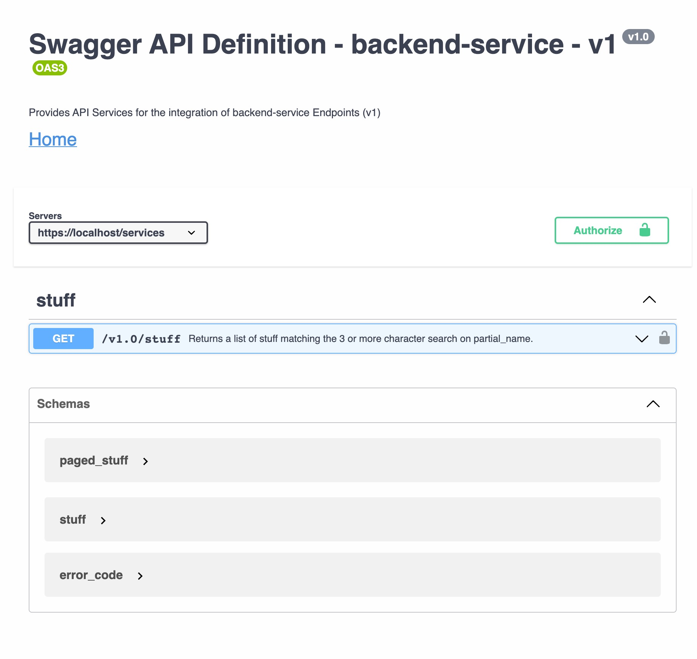

= Setup

There is one open-api.yaml file that references four parameters, two schemas and one special attribute.

[source]
----
open-api.yaml
|-- $ref: '#/components/parameters/Authorization'
|   `-- $ref: './shared-api-spec/components/parameters/header/Authorization/pv1.2.yaml'
|
|-- $ref: '#/components/parameters/limit'
|   `-- $ref: './shared-api-spec/components/parameters/query/limit/pv1.2.yaml'
|
|-- $ref: '#/components/parameters/offset'
|   `-- $ref: './shared-api-spec/components/parameters/query/offset/pv1.2.yaml'
|
|-- $ref: '#/components/parameters/partial_stuff_name'
|
|-- $ref: '#/components/schemas/paged_stuff_ov1_0'
|   `-- $ref: '#/components/schemas/stuff_ov1_0'
|       `-- $ref: './shared-api-spec/attributes/city/ov1.3.yaml'
|
`-- $ref: '#/components/schemas/error_code_ov1_2'
    `-- $ref: './shared-api-spec/components/schemas/error_code/ov1.2.yaml'
----

The three parameters are referenced like

[source,yaml]
----
components:
  parameters:
    {PARAMETER_NAME}:
      $ref: './shared-api-spec/components/parameters/header/{PARAMETER_NAME}/pv1.x.yaml'
----
and the `./shared-api-spec/components/parameters/header/{PARAMETER_NAME}/pv1.x.yaml` files are just plain YAMLs e.g.:

[source,yaml]
----
name: Authorization
in: header
description: Bearer Authorization Token
schema:
  type: string
required: true
----

== Build

[source,bash]
----
./mvnw clean compile
----

== Results

=== Positive

* This setup will be rendered correctly in VS Code using 42Crunch.vscode-openapi plugin

* redocly lint will successfully validate the api (`npm install && npm test`)
* swagger-merger 1.5.4 can merge this file correctly (`npm i swagger-merger -g && swagger-merger -i open-api.yaml -o merged.yaml`)

=== Negative

* openapi-generator maven plugin will not successfully validate the api: +
[source]
----
[INFO] --- openapi-generator:6.4.0:generate (default) @ backend-service ---
[WARNING] Exception while resolving:
java.lang.RuntimeException: Unable to load RELATIVE ref: pv1.2 path: /workspaces/openapi-generator-issues/0-simple-example
    at io.swagger.v3.parser.util.RefUtils.readExternalRef (RefUtils.java:243)
    ...
    at org.codehaus.plexus.classworlds.launcher.Launcher.main (Launcher.java:347)
Caused by: java.lang.RuntimeException: Could not find pv1.2 on the classpath
    at io.swagger.v3.parser.util.ClasspathHelper.loadFileFromClasspath (ClasspathHelper.java:31)
    ...
    at org.codehaus.plexus.classworlds.launcher.Launcher.main (Launcher.java:347)
[WARNING] Failed to get the schema name: pv1.2
[WARNING] Failed to get the schema name: pv1.2
[WARNING] Failed to get the schema name: pv1.2
[WARNING] Failed to get the schema name: ./shared-api-spec/attributes/city/ov1.3.yaml
[WARNING] Failed to get the schema name: ./shared-api-spec/attributes/city/ov1.3.yaml
[WARNING] Failed to get the schema name: ./shared-api-spec/components/schemas/error_code/ov1.2.yaml
[WARNING] Failed to get the schema name: ./shared-api-spec/components/schemas/error_code/ov1.2.yaml
[WARNING] /workspaces/openapi-generator-issues/0-simple-example/open-api.yaml [0:0]: unexpected error in Open-API generation
org.openapitools.codegen.SpecValidationException: There were issues with the specification. The option can be disabled via validateSpec (Maven/Gradle) or --skip-validate-spec (CLI).
 | Error count: 1, Warning count: 0
Errors:
        -Unable to load RELATIVE ref: pv1.2 path: /workspaces/openapi-generator-issues/0-simple-example

    at org.openapitools.codegen.config.CodegenConfigurator.toContext (CodegenConfigurator.java:620)
    ...
    at org.codehaus.plexus.classworlds.launcher.Launcher.main (Launcher.java:347)
[ERROR]
org.openapitools.codegen.SpecValidationException: There were issues with the specification. The option can be disabled via validateSpec (Maven/Gradle) or --skip-validate-spec (CLI).
 | Error count: 1, Warning count: 0
Errors:
        -Unable to load RELATIVE ref: pv1.2 path: /workspaces/openapi-generator-issues/0-simple-example

    at org.openapitools.codegen.config.CodegenConfigurator.toContext (CodegenConfigurator.java:620)
    ...
    at org.codehaus.plexus.classworlds.launcher.Launcher.main (Launcher.java:347)
----
* if I skip the validation (`<skipValidateSpec>true</skipValidateSpec>`) openapi-generator maven plugin will fail: +
[source]
----
[INFO] --- openapi-generator:6.4.0:generate (default) @ backend-service ---
[WARNING] Exception while resolving:
java.lang.RuntimeException: Unable to load RELATIVE ref: pv1.2 path: /workspaces/openapi-generator-issues/0-simple-example
    at io.swagger.v3.parser.util.RefUtils.readExternalRef (RefUtils.java:243)
    ...
    at org.codehaus.plexus.classworlds.launcher.Launcher.main (Launcher.java:347)
Caused by: java.lang.RuntimeException: Could not find pv1.2 on the classpath
    at io.swagger.v3.parser.util.ClasspathHelper.loadFileFromClasspath (ClasspathHelper.java:31)
    ...
    at org.codehaus.plexus.classworlds.launcher.Launcher.main (Launcher.java:347)
[WARNING] Failed to get the schema name: pv1.2
[WARNING] Failed to get the schema name: pv1.2
[WARNING] Failed to get the schema name: pv1.2
[WARNING] Failed to get the schema name: ./shared-api-spec/attributes/city/ov1.3.yaml
[WARNING] Failed to get the schema name: ./shared-api-spec/attributes/city/ov1.3.yaml
[WARNING] Failed to get the schema name: ./shared-api-spec/components/schemas/error_code/ov1.2.yaml
[WARNING] Failed to get the schema name: ./shared-api-spec/components/schemas/error_code/ov1.2.yaml
[WARNING] There were issues with the specification, but validation has been explicitly disabled.
Errors:
        -Unable to load RELATIVE ref: pv1.2 path: /workspaces/openapi-generator-issues/0-simple-example

[INFO] Generating with dryRun=false
[INFO] Output directory (/workspaces/openapi-generator-issues/0-simple-example/target/generated-sources/openapi) does not exist, or is inaccessible. No file (.openapi-generator-ignore) will be evaluated.
[INFO] OpenAPI Generator: spring (server)
[INFO] Generator 'spring' is considered stable.
[INFO] ----------------------------------
[INFO] Environment variable JAVA_POST_PROCESS_FILE not defined so the Java code may not be properly formatted. To define it, try 'export JAVA_POST_PROCESS_FILE="/usr/local/bin/clang-format -i"' (Linux/Mac)
[INFO] NOTE: To enable file post-processing, 'enablePostProcessFile' must be set to `true` (--enable-post-process-file for CLI).
[INFO] Invoker Package Name, originally not set, is now derived from api package name:
[INFO] Inline schema created as stuff_ov1_0_supplier. To have complete control of the model name, set the `title` field or use the inlineSchemaNameMapping option (--inline-schema-name-mappings in CLI).
[INFO] Inline schema created as stuff_ov1_0_address. To have complete control of the model name, set the `title` field or use the inlineSchemaNameMapping option (--inline-schema-name-mappings in CLI).
[INFO] Processing operation return_paged_stuff_ov1_0
[WARNING] Failed to get the schema name: pv1.2
[WARNING] Failed to get the schema name: pv1.2
[WARNING] Failed to get the schema name: pv1.2
[WARNING] Failed to get the schema name: ./shared-api-spec/attributes/city/ov1.3.yaml
[WARNING] Failed to get the schema name: ./shared-api-spec/attributes/city/ov1.3.yaml
[WARNING] Failed to get the schema name: ./shared-api-spec/components/schemas/error_code/ov1.2.yaml
[WARNING] Failed to get the schema name: ./shared-api-spec/components/schemas/error_code/ov1.2.yaml
[WARNING] Failed to get the schema name: ./shared-api-spec/components/schemas/error_code/ov1.2.yaml
[WARNING] ./shared-api-spec/components/schemas/error_code/ov1.2.yaml is not defined
[WARNING] Failed to get the schema name: ./shared-api-spec/components/schemas/error_code/ov1.2.yaml
[WARNING] Failed to get the schema name: ./shared-api-spec/components/schemas/error_code/ov1.2.yaml
[WARNING] ./shared-api-spec/components/schemas/error_code/ov1.2.yaml is not defined
[WARNING] Failed to get the schema name: ./shared-api-spec/components/schemas/error_code/ov1.2.yaml
[WARNING] Error obtaining the datatype from ref: ./shared-api-spec/components/schemas/error_code/ov1.2.yaml. Default to 'object'
[WARNING] Failed to get the schema name: ./shared-api-spec/attributes/city/ov1.3.yaml
[WARNING] ./shared-api-spec/attributes/city/ov1.3.yaml is not defined
[WARNING] Failed to get the schema name: ./shared-api-spec/attributes/city/ov1.3.yaml
[WARNING] ./shared-api-spec/attributes/city/ov1.3.yaml is not defined
[WARNING] Failed to get the schema name: ./shared-api-spec/attributes/city/ov1.3.yaml
[WARNING] ./shared-api-spec/attributes/city/ov1.3.yaml is not defined
[WARNING] Failed to get the schema name: ./shared-api-spec/attributes/city/ov1.3.yaml
[WARNING] Error obtaining the datatype from ref: ./shared-api-spec/attributes/city/ov1.3.yaml. Default to 'object'
[WARNING] Failed to get the schema name: ./shared-api-spec/attributes/city/ov1.3.yaml
[WARNING] Failed to get the schema name: ./shared-api-spec/attributes/city/ov1.3.yaml
[WARNING] Failed to get the schema name: ./shared-api-spec/attributes/city/ov1.3.yaml
[WARNING] Failed to get the schema name: ./shared-api-spec/attributes/city/ov1.3.yaml
[WARNING] ./shared-api-spec/attributes/city/ov1.3.yaml is not defined
[WARNING] Failed to get the schema name: ./shared-api-spec/attributes/city/ov1.3.yaml
[WARNING] ./shared-api-spec/attributes/city/ov1.3.yaml is not defined
[WARNING] Failed to get the schema name: ./shared-api-spec/attributes/city/ov1.3.yaml
[WARNING] Error obtaining the datatype from ref: ./shared-api-spec/attributes/city/ov1.3.yaml. Default to 'object'
[WARNING] Failed to get the schema name: ./shared-api-spec/attributes/city/ov1.3.yaml
[WARNING] ./shared-api-spec/attributes/city/ov1.3.yaml is not defined
[WARNING] Failed to get the schema name: ./shared-api-spec/attributes/city/ov1.3.yaml
[WARNING] Error obtaining the datatype from ref: ./shared-api-spec/attributes/city/ov1.3.yaml. Default to 'object'
[WARNING] Failed to get the schema name: ./shared-api-spec/attributes/city/ov1.3.yaml
[WARNING] ./shared-api-spec/attributes/city/ov1.3.yaml is not defined
[WARNING] Failed to get the schema name: ./shared-api-spec/attributes/city/ov1.3.yaml
[WARNING] Error obtaining the datatype from ref: ./shared-api-spec/attributes/city/ov1.3.yaml. Default to 'object'
[WARNING] Failed to get the schema name: ./shared-api-spec/attributes/city/ov1.3.yaml
[INFO] writing file /workspaces/openapi-generator-issues/0-simple-example/target/generated-sources/openapi/src/main/java/api/model/PagedSuffOv10DTO.java
[INFO] writing file /workspaces/openapi-generator-issues/0-simple-example/target/generated-sources/openapi/src/main/java/api/model/StuffOv1AddressDTO.java
[INFO] writing file /workspaces/openapi-generator-issues/0-simple-example/target/generated-sources/openapi/src/main/java/api/model/StuffOv1DTO.java
[INFO] writing file /workspaces/openapi-generator-issues/0-simple-example/target/generated-sources/openapi/src/main/java/api/model/StuffOv1SupplierDTO.java
[WARNING] Failed to get the schema name: ./shared-api-spec/components/schemas/error_code/ov1.2.yaml
[WARNING] ./shared-api-spec/components/schemas/error_code/ov1.2.yaml is not defined
[WARNING] Failed to get the schema name: ./shared-api-spec/components/schemas/error_code/ov1.2.yaml
[WARNING] ./shared-api-spec/components/schemas/error_code/ov1.2.yaml is not defined
[WARNING] Failed to get the schema name: ./shared-api-spec/components/schemas/error_code/ov1.2.yaml
[WARNING] ./shared-api-spec/components/schemas/error_code/ov1.2.yaml is not defined
[WARNING] Failed to get the schema name: ./shared-api-spec/components/schemas/error_code/ov1.2.yaml
[WARNING] Error obtaining the datatype from ref: ./shared-api-spec/components/schemas/error_code/ov1.2.yaml. Default to 'object'
[WARNING] Failed to get the schema name: ./shared-api-spec/components/schemas/error_code/ov1.2.yaml
[WARNING] Failed to get the schema name: ./shared-api-spec/components/schemas/error_code/ov1.2.yaml
[WARNING] Failed to get the schema name: ./shared-api-spec/components/schemas/error_code/ov1.2.yaml
[WARNING] Failed to get the schema name: ./shared-api-spec/components/schemas/error_code/ov1.2.yaml
[WARNING] ./shared-api-spec/components/schemas/error_code/ov1.2.yaml is not defined
[WARNING] Failed to get the schema name: ./shared-api-spec/components/schemas/error_code/ov1.2.yaml
[WARNING] ./shared-api-spec/components/schemas/error_code/ov1.2.yaml is not defined
[WARNING] Failed to get the schema name: ./shared-api-spec/components/schemas/error_code/ov1.2.yaml
[WARNING] Error obtaining the datatype from ref: ./shared-api-spec/components/schemas/error_code/ov1.2.yaml. Default to 'object'
[WARNING] Failed to get the schema name: ./shared-api-spec/components/schemas/error_code/ov1.2.yaml
[WARNING] ./shared-api-spec/components/schemas/error_code/ov1.2.yaml is not defined
[WARNING] Failed to get the schema name: ./shared-api-spec/components/schemas/error_code/ov1.2.yaml
[WARNING] Error obtaining the datatype from ref: ./shared-api-spec/components/schemas/error_code/ov1.2.yaml. Default to 'object'
[WARNING] Failed to get the schema name: ./shared-api-spec/components/schemas/error_code/ov1.2.yaml
[WARNING] ./shared-api-spec/components/schemas/error_code/ov1.2.yaml is not defined
[WARNING] Failed to get the schema name: ./shared-api-spec/components/schemas/error_code/ov1.2.yaml
[WARNING] Error obtaining the datatype from ref: ./shared-api-spec/components/schemas/error_code/ov1.2.yaml. Default to 'object'
[WARNING] Failed to get the schema name: ./shared-api-spec/components/schemas/error_code/ov1.2.yaml
[WARNING] Failed to get the schema name: ./shared-api-spec/components/schemas/error_code/ov1.2.yaml
[WARNING] ./shared-api-spec/components/schemas/error_code/ov1.2.yaml is not defined
[WARNING] Failed to get the schema name: ./shared-api-spec/components/schemas/error_code/ov1.2.yaml
[WARNING] ./shared-api-spec/components/schemas/error_code/ov1.2.yaml is not defined
[WARNING] Failed to get the schema name: ./shared-api-spec/components/schemas/error_code/ov1.2.yaml
[WARNING] Error obtaining the datatype from ref: ./shared-api-spec/components/schemas/error_code/ov1.2.yaml. Default to 'object'
[WARNING] Failed to get the schema name: ./shared-api-spec/components/schemas/error_code/ov1.2.yaml
[WARNING] ./shared-api-spec/components/schemas/error_code/ov1.2.yaml is not defined
[WARNING] Failed to get the schema name: ./shared-api-spec/components/schemas/error_code/ov1.2.yaml
[WARNING] ./shared-api-spec/components/schemas/error_code/ov1.2.yaml is not defined
[WARNING] Failed to get the schema name: ./shared-api-spec/components/schemas/error_code/ov1.2.yaml
[WARNING] Error obtaining the datatype from ref: ./shared-api-spec/components/schemas/error_code/ov1.2.yaml. Default to 'object'
[WARNING] Failed to get the schema name: ./shared-api-spec/components/schemas/error_code/ov1.2.yaml
[WARNING] Failed to get the schema name: ./shared-api-spec/components/schemas/error_code/ov1.2.yaml
[WARNING] Failed to get the schema name: ./shared-api-spec/components/schemas/error_code/ov1.2.yaml
[WARNING] Failed to get the schema name: ./shared-api-spec/components/schemas/error_code/ov1.2.yaml
[WARNING] ./shared-api-spec/components/schemas/error_code/ov1.2.yaml is not defined
[WARNING] Failed to get the schema name: ./shared-api-spec/components/schemas/error_code/ov1.2.yaml
[WARNING] ./shared-api-spec/components/schemas/error_code/ov1.2.yaml is not defined
[WARNING] Failed to get the schema name: ./shared-api-spec/components/schemas/error_code/ov1.2.yaml
[WARNING] Error obtaining the datatype from ref: ./shared-api-spec/components/schemas/error_code/ov1.2.yaml. Default to 'object'
[WARNING] Failed to get the schema name: ./shared-api-spec/components/schemas/error_code/ov1.2.yaml
[WARNING] ./shared-api-spec/components/schemas/error_code/ov1.2.yaml is not defined
[WARNING] Failed to get the schema name: ./shared-api-spec/components/schemas/error_code/ov1.2.yaml
[WARNING] Error obtaining the datatype from ref: ./shared-api-spec/components/schemas/error_code/ov1.2.yaml. Default to 'object'
[WARNING] Failed to get the schema name: ./shared-api-spec/components/schemas/error_code/ov1.2.yaml
[WARNING] ./shared-api-spec/components/schemas/error_code/ov1.2.yaml is not defined
[WARNING] Failed to get the schema name: ./shared-api-spec/components/schemas/error_code/ov1.2.yaml
[WARNING] Error obtaining the datatype from ref: ./shared-api-spec/components/schemas/error_code/ov1.2.yaml. Default to 'object'
[WARNING] Failed to get the schema name: ./shared-api-spec/components/schemas/error_code/ov1.2.yaml
[WARNING] Failed to get the schema name: ./shared-api-spec/components/schemas/error_code/ov1.2.yaml
[WARNING] ./shared-api-spec/components/schemas/error_code/ov1.2.yaml is not defined
[WARNING] Failed to get the schema name: ./shared-api-spec/components/schemas/error_code/ov1.2.yaml
[WARNING] ./shared-api-spec/components/schemas/error_code/ov1.2.yaml is not defined
[WARNING] Failed to get the schema name: ./shared-api-spec/components/schemas/error_code/ov1.2.yaml
[WARNING] ./shared-api-spec/components/schemas/error_code/ov1.2.yaml is not defined
[WARNING] Failed to get the schema name: ./shared-api-spec/components/schemas/error_code/ov1.2.yaml
[WARNING] Error obtaining the datatype from ref: ./shared-api-spec/components/schemas/error_code/ov1.2.yaml. Default to 'object'
[WARNING] Failed to get the schema name: ./shared-api-spec/components/schemas/error_code/ov1.2.yaml
[WARNING] ./shared-api-spec/components/schemas/error_code/ov1.2.yaml is not defined
[WARNING] Failed to get the schema name: ./shared-api-spec/components/schemas/error_code/ov1.2.yaml
[WARNING] ./shared-api-spec/components/schemas/error_code/ov1.2.yaml is not defined
[WARNING] Failed to get the schema name: ./shared-api-spec/components/schemas/error_code/ov1.2.yaml
[WARNING] Error obtaining the datatype from ref: ./shared-api-spec/components/schemas/error_code/ov1.2.yaml. Default to 'object'
[WARNING] Failed to get the schema name: ./shared-api-spec/components/schemas/error_code/ov1.2.yaml
[WARNING] Failed to get the schema name: ./shared-api-spec/components/schemas/error_code/ov1.2.yaml
[WARNING] Failed to get the schema name: ./shared-api-spec/components/schemas/error_code/ov1.2.yaml
[WARNING] Failed to get the schema name: ./shared-api-spec/components/schemas/error_code/ov1.2.yaml
[WARNING] ./shared-api-spec/components/schemas/error_code/ov1.2.yaml is not defined
[WARNING] Failed to get the schema name: ./shared-api-spec/components/schemas/error_code/ov1.2.yaml
[WARNING] ./shared-api-spec/components/schemas/error_code/ov1.2.yaml is not defined
[WARNING] Failed to get the schema name: ./shared-api-spec/components/schemas/error_code/ov1.2.yaml
[WARNING] Error obtaining the datatype from ref: ./shared-api-spec/components/schemas/error_code/ov1.2.yaml. Default to 'object'
[WARNING] Failed to get the schema name: ./shared-api-spec/components/schemas/error_code/ov1.2.yaml
[WARNING] ./shared-api-spec/components/schemas/error_code/ov1.2.yaml is not defined
[WARNING] Failed to get the schema name: ./shared-api-spec/components/schemas/error_code/ov1.2.yaml
[WARNING] Error obtaining the datatype from ref: ./shared-api-spec/components/schemas/error_code/ov1.2.yaml. Default to 'object'
[WARNING] Failed to get the schema name: ./shared-api-spec/components/schemas/error_code/ov1.2.yaml
[WARNING] ./shared-api-spec/components/schemas/error_code/ov1.2.yaml is not defined
[WARNING] Failed to get the schema name: ./shared-api-spec/components/schemas/error_code/ov1.2.yaml
[WARNING] Error obtaining the datatype from ref: ./shared-api-spec/components/schemas/error_code/ov1.2.yaml. Default to 'object'
[WARNING] Failed to get the schema name: ./shared-api-spec/components/schemas/error_code/ov1.2.yaml
[WARNING] Failed to get the schema name: ./shared-api-spec/components/schemas/error_code/ov1.2.yaml
[WARNING] ./shared-api-spec/components/schemas/error_code/ov1.2.yaml is not defined
[WARNING] Failed to get the schema name: ./shared-api-spec/components/schemas/error_code/ov1.2.yaml
[WARNING] ./shared-api-spec/components/schemas/error_code/ov1.2.yaml is not defined
[WARNING] Failed to get the schema name: ./shared-api-spec/components/schemas/error_code/ov1.2.yaml
[WARNING] ./shared-api-spec/components/schemas/error_code/ov1.2.yaml is not defined
[WARNING] Failed to get the schema name: ./shared-api-spec/components/schemas/error_code/ov1.2.yaml
[WARNING] Error obtaining the datatype from ref: ./shared-api-spec/components/schemas/error_code/ov1.2.yaml. Default to 'object'
[WARNING] Failed to get the schema name: ./shared-api-spec/components/schemas/error_code/ov1.2.yaml
[WARNING] ./shared-api-spec/components/schemas/error_code/ov1.2.yaml is not defined
[WARNING] Failed to get the schema name: ./shared-api-spec/components/schemas/error_code/ov1.2.yaml
[WARNING] ./shared-api-spec/components/schemas/error_code/ov1.2.yaml is not defined
[WARNING] Failed to get the schema name: ./shared-api-spec/components/schemas/error_code/ov1.2.yaml
[WARNING] Error obtaining the datatype from ref: ./shared-api-spec/components/schemas/error_code/ov1.2.yaml. Default to 'object'
[WARNING] Failed to get the schema name: ./shared-api-spec/components/schemas/error_code/ov1.2.yaml
[WARNING] Failed to get the schema name: ./shared-api-spec/components/schemas/error_code/ov1.2.yaml
[WARNING] Failed to get the schema name: ./shared-api-spec/components/schemas/error_code/ov1.2.yaml
[WARNING] Failed to get the schema name: ./shared-api-spec/components/schemas/error_code/ov1.2.yaml
[WARNING] ./shared-api-spec/components/schemas/error_code/ov1.2.yaml is not defined
[WARNING] Failed to get the schema name: ./shared-api-spec/components/schemas/error_code/ov1.2.yaml
[WARNING] ./shared-api-spec/components/schemas/error_code/ov1.2.yaml is not defined
[WARNING] Failed to get the schema name: ./shared-api-spec/components/schemas/error_code/ov1.2.yaml
[WARNING] Error obtaining the datatype from ref: ./shared-api-spec/components/schemas/error_code/ov1.2.yaml. Default to 'object'
[WARNING] Failed to get the schema name: ./shared-api-spec/components/schemas/error_code/ov1.2.yaml
[WARNING] ./shared-api-spec/components/schemas/error_code/ov1.2.yaml is not defined
[WARNING] Failed to get the schema name: ./shared-api-spec/components/schemas/error_code/ov1.2.yaml
[WARNING] Error obtaining the datatype from ref: ./shared-api-spec/components/schemas/error_code/ov1.2.yaml. Default to 'object'
[WARNING] Failed to get the schema name: ./shared-api-spec/components/schemas/error_code/ov1.2.yaml
[WARNING] ./shared-api-spec/components/schemas/error_code/ov1.2.yaml is not defined
[WARNING] Failed to get the schema name: ./shared-api-spec/components/schemas/error_code/ov1.2.yaml
[WARNING] Error obtaining the datatype from ref: ./shared-api-spec/components/schemas/error_code/ov1.2.yaml. Default to 'object'
[WARNING] Failed to get the schema name: ./shared-api-spec/components/schemas/error_code/ov1.2.yaml
[WARNING] Failed to get the schema name: ./shared-api-spec/components/schemas/error_code/ov1.2.yaml
[WARNING] ./shared-api-spec/components/schemas/error_code/ov1.2.yaml is not defined
[WARNING] Failed to get the schema name: ./shared-api-spec/components/schemas/error_code/ov1.2.yaml
[WARNING] ./shared-api-spec/components/schemas/error_code/ov1.2.yaml is not defined
[WARNING] Failed to get the schema name: ./shared-api-spec/components/schemas/error_code/ov1.2.yaml
[WARNING] ./shared-api-spec/components/schemas/error_code/ov1.2.yaml is not defined
[WARNING] Failed to get the schema name: ./shared-api-spec/components/schemas/error_code/ov1.2.yaml
[WARNING] Error obtaining the datatype from ref: ./shared-api-spec/components/schemas/error_code/ov1.2.yaml. Default to 'object'
[WARNING] Failed to get the schema name: ./shared-api-spec/components/schemas/error_code/ov1.2.yaml
[WARNING] ./shared-api-spec/components/schemas/error_code/ov1.2.yaml is not defined
[WARNING] Failed to get the schema name: ./shared-api-spec/components/schemas/error_code/ov1.2.yaml
[WARNING] ./shared-api-spec/components/schemas/error_code/ov1.2.yaml is not defined
[WARNING] Failed to get the schema name: ./shared-api-spec/components/schemas/error_code/ov1.2.yaml
[WARNING] Error obtaining the datatype from ref: ./shared-api-spec/components/schemas/error_code/ov1.2.yaml. Default to 'object'
[WARNING] Failed to get the schema name: ./shared-api-spec/components/schemas/error_code/ov1.2.yaml
[WARNING] Failed to get the schema name: ./shared-api-spec/components/schemas/error_code/ov1.2.yaml
[WARNING] Failed to get the schema name: ./shared-api-spec/components/schemas/error_code/ov1.2.yaml
[WARNING] Failed to get the schema name: ./shared-api-spec/components/schemas/error_code/ov1.2.yaml
[WARNING] ./shared-api-spec/components/schemas/error_code/ov1.2.yaml is not defined
[WARNING] Failed to get the schema name: ./shared-api-spec/components/schemas/error_code/ov1.2.yaml
[WARNING] ./shared-api-spec/components/schemas/error_code/ov1.2.yaml is not defined
[WARNING] Failed to get the schema name: ./shared-api-spec/components/schemas/error_code/ov1.2.yaml
[WARNING] Error obtaining the datatype from ref: ./shared-api-spec/components/schemas/error_code/ov1.2.yaml. Default to 'object'
[WARNING] Failed to get the schema name: ./shared-api-spec/components/schemas/error_code/ov1.2.yaml
[WARNING] ./shared-api-spec/components/schemas/error_code/ov1.2.yaml is not defined
[WARNING] Failed to get the schema name: ./shared-api-spec/components/schemas/error_code/ov1.2.yaml
[WARNING] Error obtaining the datatype from ref: ./shared-api-spec/components/schemas/error_code/ov1.2.yaml. Default to 'object'
[WARNING] Failed to get the schema name: ./shared-api-spec/components/schemas/error_code/ov1.2.yaml
[WARNING] ./shared-api-spec/components/schemas/error_code/ov1.2.yaml is not defined
[WARNING] Failed to get the schema name: ./shared-api-spec/components/schemas/error_code/ov1.2.yaml
[WARNING] Error obtaining the datatype from ref: ./shared-api-spec/components/schemas/error_code/ov1.2.yaml. Default to 'object'
[WARNING] Failed to get the schema name: ./shared-api-spec/components/schemas/error_code/ov1.2.yaml
[WARNING] Failed to get the schema name: ./shared-api-spec/components/schemas/error_code/ov1.2.yaml
[WARNING] ./shared-api-spec/components/schemas/error_code/ov1.2.yaml is not defined
[WARNING] Failed to get the schema name: ./shared-api-spec/components/schemas/error_code/ov1.2.yaml
[WARNING] ./shared-api-spec/components/schemas/error_code/ov1.2.yaml is not defined
[WARNING] Failed to get the schema name: ./shared-api-spec/components/schemas/error_code/ov1.2.yaml
[WARNING] ./shared-api-spec/components/schemas/error_code/ov1.2.yaml is not defined
[WARNING] Failed to get the schema name: ./shared-api-spec/components/schemas/error_code/ov1.2.yaml
[WARNING] Error obtaining the datatype from ref: ./shared-api-spec/components/schemas/error_code/ov1.2.yaml. Default to 'object'
[WARNING] Failed to get the schema name: ./shared-api-spec/components/schemas/error_code/ov1.2.yaml
[WARNING] ./shared-api-spec/components/schemas/error_code/ov1.2.yaml is not defined
[WARNING] Failed to get the schema name: ./shared-api-spec/components/schemas/error_code/ov1.2.yaml
[WARNING] ./shared-api-spec/components/schemas/error_code/ov1.2.yaml is not defined
[WARNING] Failed to get the schema name: ./shared-api-spec/components/schemas/error_code/ov1.2.yaml
[WARNING] Error obtaining the datatype from ref: ./shared-api-spec/components/schemas/error_code/ov1.2.yaml. Default to 'object'
[WARNING] Failed to get the schema name: ./shared-api-spec/components/schemas/error_code/ov1.2.yaml
[WARNING] Failed to get the schema name: ./shared-api-spec/components/schemas/error_code/ov1.2.yaml
[WARNING] Failed to get the schema name: ./shared-api-spec/components/schemas/error_code/ov1.2.yaml
[WARNING] Failed to get the schema name: ./shared-api-spec/components/schemas/error_code/ov1.2.yaml
[WARNING] ./shared-api-spec/components/schemas/error_code/ov1.2.yaml is not defined
[WARNING] Failed to get the schema name: ./shared-api-spec/components/schemas/error_code/ov1.2.yaml
[WARNING] ./shared-api-spec/components/schemas/error_code/ov1.2.yaml is not defined
[WARNING] Failed to get the schema name: ./shared-api-spec/components/schemas/error_code/ov1.2.yaml
[WARNING] Error obtaining the datatype from ref: ./shared-api-spec/components/schemas/error_code/ov1.2.yaml. Default to 'object'
[WARNING] Failed to get the schema name: ./shared-api-spec/components/schemas/error_code/ov1.2.yaml
[WARNING] ./shared-api-spec/components/schemas/error_code/ov1.2.yaml is not defined
[WARNING] Failed to get the schema name: ./shared-api-spec/components/schemas/error_code/ov1.2.yaml
[WARNING] Error obtaining the datatype from ref: ./shared-api-spec/components/schemas/error_code/ov1.2.yaml. Default to 'object'
[WARNING] Failed to get the schema name: ./shared-api-spec/components/schemas/error_code/ov1.2.yaml
[WARNING] ./shared-api-spec/components/schemas/error_code/ov1.2.yaml is not defined
[WARNING] Failed to get the schema name: ./shared-api-spec/components/schemas/error_code/ov1.2.yaml
[WARNING] Error obtaining the datatype from ref: ./shared-api-spec/components/schemas/error_code/ov1.2.yaml. Default to 'object'
[WARNING] Failed to get the schema name: ./shared-api-spec/components/schemas/error_code/ov1.2.yaml
[WARNING] Failed to get the schema name: ./shared-api-spec/components/schemas/error_code/ov1.2.yaml
[WARNING] ./shared-api-spec/components/schemas/error_code/ov1.2.yaml is not defined
[WARNING] Failed to get the schema name: ./shared-api-spec/components/schemas/error_code/ov1.2.yaml
[WARNING] ./shared-api-spec/components/schemas/error_code/ov1.2.yaml is not defined
[WARNING] Failed to get the schema name: ./shared-api-spec/components/schemas/error_code/ov1.2.yaml
[WARNING] ./shared-api-spec/components/schemas/error_code/ov1.2.yaml is not defined
[WARNING] Failed to get the schema name: ./shared-api-spec/components/schemas/error_code/ov1.2.yaml
[WARNING] Error obtaining the datatype from ref: ./shared-api-spec/components/schemas/error_code/ov1.2.yaml. Default to 'object'
[WARNING] Failed to get the schema name: ./shared-api-spec/components/schemas/error_code/ov1.2.yaml
[WARNING] ./shared-api-spec/components/schemas/error_code/ov1.2.yaml is not defined
[WARNING] Failed to get the schema name: ./shared-api-spec/components/schemas/error_code/ov1.2.yaml
[WARNING] ./shared-api-spec/components/schemas/error_code/ov1.2.yaml is not defined
[WARNING] Failed to get the schema name: ./shared-api-spec/components/schemas/error_code/ov1.2.yaml
[WARNING] Error obtaining the datatype from ref: ./shared-api-spec/components/schemas/error_code/ov1.2.yaml. Default to 'object'
[WARNING] Failed to get the schema name: ./shared-api-spec/components/schemas/error_code/ov1.2.yaml
[WARNING] Failed to get the schema name: ./shared-api-spec/components/schemas/error_code/ov1.2.yaml
[WARNING] Failed to get the schema name: ./shared-api-spec/components/schemas/error_code/ov1.2.yaml
[WARNING] Failed to get the schema name: ./shared-api-spec/components/schemas/error_code/ov1.2.yaml
[WARNING] ./shared-api-spec/components/schemas/error_code/ov1.2.yaml is not defined
[WARNING] Failed to get the schema name: ./shared-api-spec/components/schemas/error_code/ov1.2.yaml
[WARNING] ./shared-api-spec/components/schemas/error_code/ov1.2.yaml is not defined
[WARNING] Failed to get the schema name: ./shared-api-spec/components/schemas/error_code/ov1.2.yaml
[WARNING] Error obtaining the datatype from ref: ./shared-api-spec/components/schemas/error_code/ov1.2.yaml. Default to 'object'
[WARNING] Failed to get the schema name: ./shared-api-spec/components/schemas/error_code/ov1.2.yaml
[WARNING] ./shared-api-spec/components/schemas/error_code/ov1.2.yaml is not defined
[WARNING] Failed to get the schema name: ./shared-api-spec/components/schemas/error_code/ov1.2.yaml
[WARNING] Error obtaining the datatype from ref: ./shared-api-spec/components/schemas/error_code/ov1.2.yaml. Default to 'object'
[WARNING] Failed to get the schema name: ./shared-api-spec/components/schemas/error_code/ov1.2.yaml
[WARNING] ./shared-api-spec/components/schemas/error_code/ov1.2.yaml is not defined
[WARNING] Failed to get the schema name: ./shared-api-spec/components/schemas/error_code/ov1.2.yaml
[WARNING] Error obtaining the datatype from ref: ./shared-api-spec/components/schemas/error_code/ov1.2.yaml. Default to 'object'
[WARNING] Failed to get the schema name: ./shared-api-spec/components/schemas/error_code/ov1.2.yaml
[WARNING] Failed to get the schema name: ./shared-api-spec/components/schemas/error_code/ov1.2.yaml
[WARNING] ./shared-api-spec/components/schemas/error_code/ov1.2.yaml is not defined
[WARNING] Failed to get the schema name: ./shared-api-spec/components/schemas/error_code/ov1.2.yaml
[WARNING] ./shared-api-spec/components/schemas/error_code/ov1.2.yaml is not defined
[WARNING] Failed to get the schema name: ./shared-api-spec/components/schemas/error_code/ov1.2.yaml
[WARNING] ./shared-api-spec/components/schemas/error_code/ov1.2.yaml is not defined
[WARNING] Failed to get the schema name: ./shared-api-spec/components/schemas/error_code/ov1.2.yaml
[WARNING] Error obtaining the datatype from ref: ./shared-api-spec/components/schemas/error_code/ov1.2.yaml. Default to 'object'
[WARNING] Failed to get the schema name: ./shared-api-spec/components/schemas/error_code/ov1.2.yaml
[WARNING] ./shared-api-spec/components/schemas/error_code/ov1.2.yaml is not defined
[WARNING] Failed to get the schema name: ./shared-api-spec/components/schemas/error_code/ov1.2.yaml
[WARNING] ./shared-api-spec/components/schemas/error_code/ov1.2.yaml is not defined
[WARNING] Failed to get the schema name: ./shared-api-spec/components/schemas/error_code/ov1.2.yaml
[WARNING] Error obtaining the datatype from ref: ./shared-api-spec/components/schemas/error_code/ov1.2.yaml. Default to 'object'
[WARNING] Failed to get the schema name: ./shared-api-spec/components/schemas/error_code/ov1.2.yaml
[WARNING] Failed to get the schema name: ./shared-api-spec/components/schemas/error_code/ov1.2.yaml
[WARNING] Failed to get the schema name: ./shared-api-spec/components/schemas/error_code/ov1.2.yaml
[WARNING] Failed to get the schema name: ./shared-api-spec/components/schemas/error_code/ov1.2.yaml
[WARNING] ./shared-api-spec/components/schemas/error_code/ov1.2.yaml is not defined
[WARNING] Failed to get the schema name: ./shared-api-spec/components/schemas/error_code/ov1.2.yaml
[WARNING] ./shared-api-spec/components/schemas/error_code/ov1.2.yaml is not defined
[WARNING] Failed to get the schema name: ./shared-api-spec/components/schemas/error_code/ov1.2.yaml
[WARNING] Error obtaining the datatype from ref: ./shared-api-spec/components/schemas/error_code/ov1.2.yaml. Default to 'object'
[WARNING] Failed to get the schema name: ./shared-api-spec/components/schemas/error_code/ov1.2.yaml
[WARNING] ./shared-api-spec/components/schemas/error_code/ov1.2.yaml is not defined
[WARNING] Failed to get the schema name: ./shared-api-spec/components/schemas/error_code/ov1.2.yaml
[WARNING] Error obtaining the datatype from ref: ./shared-api-spec/components/schemas/error_code/ov1.2.yaml. Default to 'object'
[WARNING] Failed to get the schema name: ./shared-api-spec/components/schemas/error_code/ov1.2.yaml
[WARNING] ./shared-api-spec/components/schemas/error_code/ov1.2.yaml is not defined
[WARNING] Failed to get the schema name: ./shared-api-spec/components/schemas/error_code/ov1.2.yaml
[WARNING] Error obtaining the datatype from ref: ./shared-api-spec/components/schemas/error_code/ov1.2.yaml. Default to 'object'
[WARNING] Failed to get the schema name: ./shared-api-spec/components/schemas/error_code/ov1.2.yaml
[WARNING] Failed to get the schema name: ./shared-api-spec/components/schemas/error_code/ov1.2.yaml
[WARNING] ./shared-api-spec/components/schemas/error_code/ov1.2.yaml is not defined
[WARNING] Failed to get the schema name: ./shared-api-spec/components/schemas/error_code/ov1.2.yaml
[WARNING] ./shared-api-spec/components/schemas/error_code/ov1.2.yaml is not defined
[WARNING] Failed to get the schema name: ./shared-api-spec/components/schemas/error_code/ov1.2.yaml
[WARNING] ./shared-api-spec/components/schemas/error_code/ov1.2.yaml is not defined
[WARNING] Failed to get the schema name: ./shared-api-spec/components/schemas/error_code/ov1.2.yaml
[WARNING] Error obtaining the datatype from ref: ./shared-api-spec/components/schemas/error_code/ov1.2.yaml. Default to 'object'
[WARNING] Failed to get the schema name: ./shared-api-spec/components/schemas/error_code/ov1.2.yaml
[WARNING] ./shared-api-spec/components/schemas/error_code/ov1.2.yaml is not defined
[WARNING] Failed to get the schema name: ./shared-api-spec/components/schemas/error_code/ov1.2.yaml
[WARNING] ./shared-api-spec/components/schemas/error_code/ov1.2.yaml is not defined
[WARNING] Failed to get the schema name: ./shared-api-spec/components/schemas/error_code/ov1.2.yaml
[WARNING] Error obtaining the datatype from ref: ./shared-api-spec/components/schemas/error_code/ov1.2.yaml. Default to 'object'
[WARNING] Failed to get the schema name: ./shared-api-spec/components/schemas/error_code/ov1.2.yaml
[WARNING] Failed to get the schema name: ./shared-api-spec/components/schemas/error_code/ov1.2.yaml
[WARNING] Failed to get the schema name: ./shared-api-spec/components/schemas/error_code/ov1.2.yaml
[WARNING] Failed to get the schema name: ./shared-api-spec/components/schemas/error_code/ov1.2.yaml
[WARNING] ./shared-api-spec/components/schemas/error_code/ov1.2.yaml is not defined
[WARNING] Failed to get the schema name: ./shared-api-spec/components/schemas/error_code/ov1.2.yaml
[WARNING] ./shared-api-spec/components/schemas/error_code/ov1.2.yaml is not defined
[WARNING] Failed to get the schema name: ./shared-api-spec/components/schemas/error_code/ov1.2.yaml
[WARNING] Error obtaining the datatype from ref: ./shared-api-spec/components/schemas/error_code/ov1.2.yaml. Default to 'object'
[WARNING] Failed to get the schema name: ./shared-api-spec/components/schemas/error_code/ov1.2.yaml
[WARNING] ./shared-api-spec/components/schemas/error_code/ov1.2.yaml is not defined
[WARNING] Failed to get the schema name: ./shared-api-spec/components/schemas/error_code/ov1.2.yaml
[WARNING] Error obtaining the datatype from ref: ./shared-api-spec/components/schemas/error_code/ov1.2.yaml. Default to 'object'
[WARNING] Failed to get the schema name: ./shared-api-spec/components/schemas/error_code/ov1.2.yaml
[WARNING] ./shared-api-spec/components/schemas/error_code/ov1.2.yaml is not defined
[WARNING] Failed to get the schema name: ./shared-api-spec/components/schemas/error_code/ov1.2.yaml
[WARNING] Error obtaining the datatype from ref: ./shared-api-spec/components/schemas/error_code/ov1.2.yaml. Default to 'object'
[WARNING] Failed to get the schema name: ./shared-api-spec/components/schemas/error_code/ov1.2.yaml
[WARNING] Failed to get the schema name: ./shared-api-spec/attributes/city/ov1.3.yaml
[WARNING] Failed to get the schema name: pv1.2
[WARNING] Unknown parameter type: null
[ERROR] Not handling class Parameter {
    name: null
    in: null
    description: null
    required: null
    deprecated: null
    allowEmptyValue: null
    style: null
    explode: null
    allowReserved: null
    schema: null
    examples: null
    example: null
    content: null
    $ref: pv1.2
} as Body Parameter at the moment
[WARNING] Parameter name not defined properly. Default to UNKNOWN_PARAMETER_NAME
[ERROR] String to be sanitized is null. Default to ERROR_UNKNOWN
[WARNING] Unknown parameter type null for null
[WARNING] Failed to get the schema name: pv1.2
[WARNING] Unknown parameter type: null
[ERROR] Not handling class Parameter {
    name: null
    in: null
    description: null
    required: null
    deprecated: null
    allowEmptyValue: null
    style: null
    explode: null
    allowReserved: null
    schema: null
    examples: null
    example: null
    content: null
    $ref: pv1.2
} as Body Parameter at the moment
[WARNING] Parameter name not defined properly. Default to UNKNOWN_PARAMETER_NAME
[WARNING] Unknown parameter type null for null
[WARNING] Failed to get the schema name: pv1.2
[WARNING] Unknown parameter type: null
[ERROR] Not handling class Parameter {
    name: null
    in: null
    description: null
    required: null
    deprecated: null
    allowEmptyValue: null
    style: null
    explode: null
    allowReserved: null
    schema: null
    examples: null
    example: null
    content: null
    $ref: pv1.2
} as Body Parameter at the moment
[WARNING] Parameter name not defined properly. Default to UNKNOWN_PARAMETER_NAME
[WARNING] Unknown parameter type null for null
[INFO] writing file /workspaces/openapi-generator-issues/0-simple-example/target/generated-sources/openapi/src/main/java/api/V10Api.java
[INFO] Skipping generation of supporting files.
################################################################################
# Thanks for using OpenAPI Generator.                                          #
# Please consider donation to help us maintain this project 🙏                 #
# https://opencollective.com/openapi_generator/donate                          #
################################################################################
[INFO]
[INFO] --- resources:3.3.0:resources (default-resources) @ backend-service ---
[INFO] skip non existing resourceDirectory /workspaces/openapi-generator-issues/0-simple-example/src/main/resources
[INFO] skip non existing resourceDirectory /workspaces/openapi-generator-issues/0-simple-example/src/main/resources
[INFO]
[INFO] --- compiler:3.10.1:compile (default-compile) @ backend-service ---
[INFO] Changes detected - recompiling the module!
[INFO] Compiling 5 source files to /workspaces/openapi-generator-issues/0-simple-example/target/classes
[INFO] -------------------------------------------------------------
[ERROR] COMPILATION ERROR :
[INFO] -------------------------------------------------------------
[ERROR] /workspaces/openapi-generator-issues/0-simple-example/target/generated-sources/openapi/src/main/java/api/V10Api.java:[110,9] illegal start of type
[ERROR] /workspaces/openapi-generator-issues/0-simple-example/target/generated-sources/openapi/src/main/java/api/V10Api.java:[111,9] illegal start of type
[ERROR] /workspaces/openapi-generator-issues/0-simple-example/target/generated-sources/openapi/src/main/java/api/V10Api.java:[113,5] illegal start of type
[INFO] 3 errors
[INFO] -------------------------------------------------------------
[INFO] ------------------------------------------------------------------------
[INFO] BUILD FAILURE
[INFO] ------------------------------------------------------------------------
[INFO] Total time:  5.300 s
[INFO] Finished at: 2023-03-24T13:07:07Z
[INFO] ------------------------------------------------------------------------
[ERROR] Failed to execute goal org.apache.maven.plugins:maven-compiler-plugin:3.10.1:compile (default-compile) on project backend-service: Compilation failure: Compilation failure:
[ERROR] /workspaces/openapi-generator-issues/0-simple-example/target/generated-sources/openapi/src/main/java/api/V10Api.java:[110,9] illegal start of type
[ERROR] /workspaces/openapi-generator-issues/0-simple-example/target/generated-sources/openapi/src/main/java/api/V10Api.java:[111,9] illegal start of type
[ERROR] /workspaces/openapi-generator-issues/0-simple-example/target/generated-sources/openapi/src/main/java/api/V10Api.java:[113,5] illegal start of type
[ERROR] -> [Help 1]
[ERROR]
[ERROR] To see the full stack trace of the errors, re-run Maven with the -e switch.
[ERROR] Re-run Maven using the -X switch to enable full debug logging.
[ERROR]
[ERROR] For more information about the errors and possible solutions, please read the following articles:
[ERROR] [Help 1] http://cwiki.apache.org/confluence/display/MAVEN/MojoFailureException
----
* This setup will not be rendered correctly in IntelliJ ultimate +

image::intellij-issue.jpg[]
