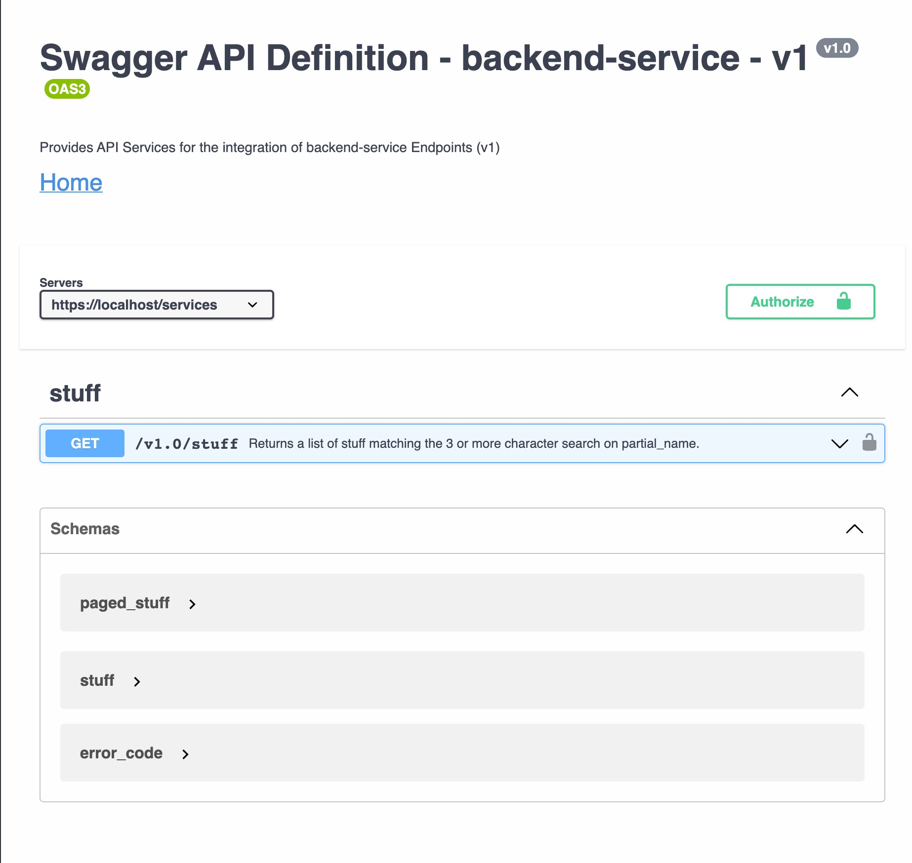
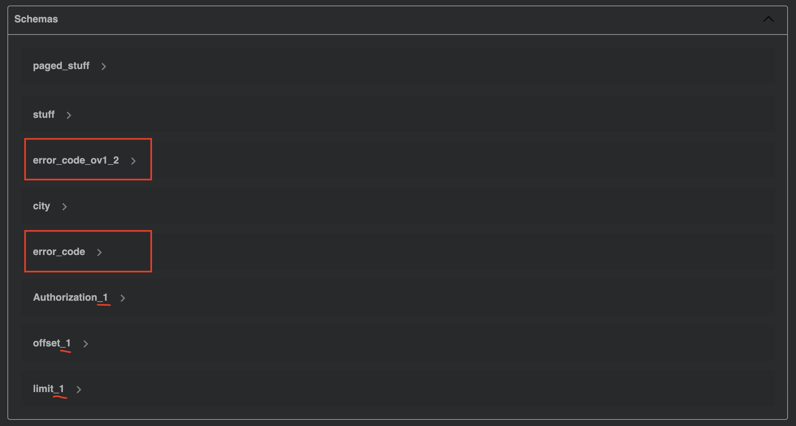

= Setup

There is one open-api.yaml file that references four parameters, two schemas and one special attribute.

But this time the paged_suff_ov1_0 and stuff_ov1 schemas are also referenced externally:

[source]
----
open-api.yaml
|-- $ref: '#/components/parameters/Authorization'
|   `-- $ref: './shared-api-spec/components/parameters/header/Authorization/pv1.2.yaml#/Authorization'
|
|-- $ref: '#/components/parameters/limit'
|   `-- $ref: './shared-api-spec/components/parameters/query/limit/pv1.2.yaml#/limit'
|
|-- $ref: '#/components/parameters/offset'
|   `-- $ref: './shared-api-spec/components/parameters/query/offset/pv1.2.yaml#/offset'
|
|-- $ref: '#/components/parameters/partial_stuff_name'
|
|-- $ref: #/components/schemas/paged_suff_ov1_0
|   `-- $ref: './components/schemas/paged_stuff/ov1.0.yaml'
|       `-- $ref: '../stuff/ov1.0.yaml'
|           `-- $ref: '../../../shared-api-spec/attributes/city/ov1.3.yaml'
|
`-- $ref: '#/components/schemas/error_code_ov1_2'
    `-- $ref: ./shared-api-spec/components/schemas/error_code/ov1.2.yaml
----

The three parameters are referenced like in example 1:

[source,yaml]
----
components:
  parameters:
    {PARAMETER_NAME}:
      $ref: './shared-api-spec/components/parameters/header/{PARAMETER_NAME}/pv1.x.yaml#/{PARAMETER_NAME}'
----

and the `./shared-api-spec/components/parameters/header/{PARAMETER_NAME}/pv1.x.yaml` files are *modified*:

[cols="1a,1a"]
|===
|0-simple-example |1-simple-example

|[source,yaml]
----
name: Authorization
in: header
description: Bearer Authorization Token
schema:
  type: string
required: true
----
|[source,yaml]
----
Authorization:
  name: Authorization
  in: header
  description: Bearer Authorization Token
  schema:
    type: string
  required: true
----
|===

== Build

[source,bash]
----
./mvnw clean compile
----

== Results

=== Positive

* openapi-generator maven plugin will successfully validate the api
* *openapi-generator maven plugin will create all the files I want*
* redocly lint will successfully validate the api (`npm install && npm test`)

=== Neutral

* This setup will be rendered correctly in VS Code using 42Crunch.vscode-openapi plugin

even though the schema for "stuff" is not rendered directly. This minor issue will be addressed in the example-3.

=== Negative

* openapi-generator maven plugin *will create multiple duplicated classes*: +
see:
** `./target/generated-sources/openapi/src/main/java/api/model/ErrorCodeOv12DTO.java`
vs. `./target/generated-sources/openapi/src/main/java/api/model/Ov12DTO.java`
** `./target/generated-sources/openapi/src/main/java/api/model/PagedStuffOv10DTO.java`
vs. `./target/generated-sources/openapi/src/main/java/api/model/Ov10DTO.java`
* some of the classes are not named correctly: +
|===
|example-1 |example-2
|ErrorCodeOv12DTO.java (duplicate Ov12DTO.java) +
PagedStuffOv10DTO.java +
StuffOv1AddressDTO.java +
StuffOv1DTO.java +
StuffOv1SupplierDTO.java
|ErrorCodeOv12DTO.java (duplicate Ov12DTO.java) +
PagedStuffOv10DTO.java (duplicate Ov10DTO.java) +
Ov101AddressDTO.java (missing the title 'Stuff') +
Ov101DTO.java (missing the title 'Stuff') +
Ov101SupplierDTO.java (missing the title 'Stuff')
|===
* The name `Ov101DTO` is used here because the duplicate for `PagedStuffOv10DTO` is already named `Ov10DTO`. +
It looks like that:
** every time, there is an external referenced schema in the (base) api file, a duplicated class is generated
** every time, a transitive external reference needs to be resolved the title of that reference schema is not considered +
* This setup will *not* be rendered correctly in IntelliJ ultimate

