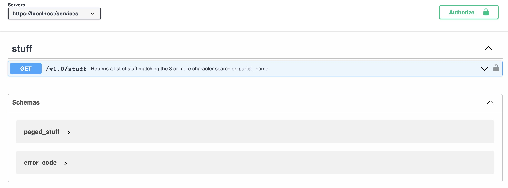

= Setup

There is one open-api.yaml file that references one path file that is then referencing one parameter, two schemas and one special attribute.

This is a simplified version of example-5. The idea was to name each file ov1_{id}.yaml and to reduce the number of referenced files.

[source]
----
open-api.yaml
|-- $ref: './paths/stuff/ov1.0.yaml'
|   |
|   |-- $ref: '../../open-api.yaml#/components/parameters/partial_stuff_name'
|   |
|   |-- $ref: '../../open-api.yaml#/components/responses/paged_stuff'
|   |   `-- $ref: '#/components/schemas/paged_stuff_ov1_1'
|   |       `-- $ref: './components/schemas/paged_stuff/ov1.1.yaml'
|   |           `-- $ref: '../../../open-api.yaml#/components/schemas/stuff_ov1_2'
|   |
|   `-- $ref: '../../open-api.yaml#/components/responses/error_code'
|       `-- $ref: '#/components/schemas/error_code_ov1_3'
|           `-- $ref: './shared-api-spec/components/schemas/error_code/ov1.3.yaml'
|
`-- $ref: '../../open-api.yaml#/components/schemas/stuff_ov1_2'
    `-- $ref: '../stuff/ov1.0.yaml'
        `-- $ref: '../../../shared-api-spec/attributes/city/ov1.4.yaml'
----

== Build

[source,bash]
----
./mvnw clean compile
----

== Results

=== Positive

* This setup will be rendered correctly in VS Code using 42Crunch.vscode-openapi plugin

* swagger-cli (4.0.4) `npm install -g @apidevtools/swagger-cli` outputs open-api.yaml is valid
* redocly lint will successfully validate the api (`npm install && npm test`)

=== Negative

* openapi-generator maven plugin will not successfully validate the api: +
[source]
----
[INFO] --- openapi-generator:6.5.0:generate (default) @ backend-service-example-3.0.1-5 ---
[WARNING] Exception while resolving:
java.lang.RuntimeException: Unable to load RELATIVE ref: ov1.1 path: /workspaces/openapi-generator-issues/example-6
    at io.swagger.v3.parser.util.RefUtils.readExternalRef (RefUtils.java:243)
    ...
    at org.apache.maven.wrapper.MavenWrapperMain.main (MavenWrapperMain.java:73)
Caused by: java.lang.RuntimeException: Could not find ov1.1 on the classpath
    at io.swagger.v3.parser.util.ClasspathHelper.loadFileFromClasspath (ClasspathHelper.java:31)
    ...
    at org.apache.maven.wrapper.MavenWrapperMain.main (MavenWrapperMain.java:73)
[WARNING] Failed to get the schema name: ov1.1
[WARNING] Failed to get the schema name: ov1.1
[WARNING] Failed to get the schema name: ov1.3
[WARNING] Failed to get the schema name: ov1.3
[WARNING] /workspaces/openapi-generator-issues/example-6/open-api.yaml [0:0]: unexpected error in Open-API generation
org.openapitools.codegen.SpecValidationException: There were issues with the specification. The option can be disabled via validateSpec (Maven/Gradle) or --skip-validate-spec (CLI).
 | Error count: 1, Warning count: 3
Errors:
        -Unable to load RELATIVE ref: ov1.1 path: /workspaces/openapi-generator-issues/example-6
Warnings:
        -Unable to load RELATIVE ref: ov1.1 path: /workspaces/openapi-generator-issues/example-6

    at org.openapitools.codegen.config.CodegenConfigurator.toContext (CodegenConfigurator.java:620)
    ...
    at org.apache.maven.wrapper.MavenWrapperMain.main (MavenWrapperMain.java:73)
[ERROR]
org.openapitools.codegen.SpecValidationException: There were issues with the specification. The option can be disabled via validateSpec (Maven/Gradle) or --skip-validate-spec (CLI).
 | Error count: 1, Warning count: 3
Errors:
        -Unable to load RELATIVE ref: ov1.1 path: /workspaces/openapi-generator-issues/example-6
Warnings:
        -Unable to load RELATIVE ref: ov1.1 path: /workspaces/openapi-generator-issues/example-6

    at org.openapitools.codegen.config.CodegenConfigurator.toContext (CodegenConfigurator.java:620)
    ...
    at org.apache.maven.wrapper.MavenWrapperMain.main (MavenWrapperMain.java:73)
[INFO] ------------------------------------------------------------------------
[INFO] BUILD FAILURE
[INFO] ------------------------------------------------------------------------
[INFO] Total time:  3.491 s
[INFO] Finished at: 2023-04-01T12:50:22Z
[INFO] ------------------------------------------------------------------------
[ERROR] Failed to execute goal org.openapitools:openapi-generator-maven-plugin:6.5.0:generate (default) on project backend-service-example-3.0.1-6: Code generation failed. See above for the full exception. -> [Help 1]
[ERROR]
[ERROR] To see the full stack trace of the errors, re-run Maven with the -e switch.
[ERROR] Re-run Maven using the -X switch to enable full debug logging.
[ERROR]
[ERROR] For more information about the errors and possible solutions, please read the following articles:
[ERROR] [Help 1] http://cwiki.apache.org/confluence/display/MAVEN/MojoExecutionException
----

* if I skip the validation (`<skipValidateSpec>true</skipValidateSpec>`) openapi-generator maven plugin will *not* fail but almost nothing will be created: +

[source]
----
[INFO] --- openapi-generator:6.5.0:generate (default) @ backend-service-example-3.0.1-6 ---
[WARNING] Exception while resolving:
java.lang.RuntimeException: Unable to load RELATIVE ref: ov1.1 path: /workspaces/openapi-generator-issues/example-6
    at io.swagger.v3.parser.util.RefUtils.readExternalRef (RefUtils.java:243)
    ...
    at org.apache.maven.wrapper.MavenWrapperMain.main (MavenWrapperMain.java:73)
Caused by: java.lang.RuntimeException: Could not find ov1.1 on the classpath
    at io.swagger.v3.parser.util.ClasspathHelper.loadFileFromClasspath (ClasspathHelper.java:31)
    ...
    at org.apache.maven.wrapper.MavenWrapperMain.main (MavenWrapperMain.java:73)
[WARNING] Failed to get the schema name: ov1.1
[WARNING] Failed to get the schema name: ov1.1
[WARNING] Failed to get the schema name: ov1.3
[WARNING] Failed to get the schema name: ov1.3
[WARNING] There were issues with the specification, but validation has been explicitly disabled.
Errors:
        -Unable to load RELATIVE ref: ov1.1 path: /workspaces/openapi-generator-issues/example-6
Warnings:
        -Unused model: ov1.3
        -Unused model: ov1.1
        -Unused model: stuff_ov1_2

[INFO] Generating with dryRun=false
[INFO] Output directory (/workspaces/openapi-generator-issues/example-6/target/generated-sources/openapi) does not exist, or is inaccessible. No file (.openapi-generator-ignore) will be evaluated.
[INFO] OpenAPI Generator: spring (server)
[INFO] Generator 'spring' is considered stable.
[INFO] ----------------------------------
[INFO] Environment variable JAVA_POST_PROCESS_FILE not defined so the Java code may not be properly formatted. To define it, try 'export JAVA_POST_PROCESS_FILE="/usr/local/bin/clang-format -i"' (Linux/Mac)
[INFO] NOTE: To enable file post-processing, 'enablePostProcessFile' must be set to `true` (--enable-post-process-file for CLI).
[INFO] Invoker Package Name, originally not set, is now derived from api package name:
[INFO] Processing operation return_paged_stuff_ov1_0
[WARNING] Failed to get the schema name: ov1.1
[WARNING] Failed to get the schema name: ov1.1
[WARNING] Failed to get the schema name: ov1.3
[WARNING] Failed to get the schema name: ov1.3
[WARNING] Failed to get the schema name: ov1.1
[WARNING] ov1.1 is not defined
[WARNING] Failed to get the schema name: ov1.1
[WARNING] Failed to get the schema name: ov1.1
[WARNING] ov1.1 is not defined
[WARNING] Failed to get the schema name: ov1.1
[WARNING] Error obtaining the datatype from ref: ov1.1. Default to 'object'
[WARNING] Failed to get the schema name: ./components/schemas/stuff/ov1.2.yaml
[WARNING] ./components/schemas/stuff/ov1.2.yaml is not defined
[WARNING] Failed to get the schema name: ./components/schemas/stuff/ov1.2.yaml
[WARNING] Failed to get the schema name: ./components/schemas/stuff/ov1.2.yaml
[WARNING] ./components/schemas/stuff/ov1.2.yaml is not defined
[WARNING] Failed to get the schema name: ./components/schemas/stuff/ov1.2.yaml
[WARNING] Error obtaining the datatype from ref: ./components/schemas/stuff/ov1.2.yaml. Default to 'object'
[WARNING] Failed to get the schema name: ov1.3
[WARNING] ov1.3 is not defined
[WARNING] Failed to get the schema name: ov1.3
[WARNING] Failed to get the schema name: ov1.3
[WARNING] ov1.3 is not defined
[WARNING] Failed to get the schema name: ov1.3
[WARNING] Error obtaining the datatype from ref: ov1.3. Default to 'object'
[WARNING] Failed to get the schema name: open-api.yaml#/components/schemas/stuff_ov1_2
[WARNING] open-api.yaml#/components/schemas/stuff_ov1_2 is not defined
[WARNING] Failed to get the schema name: open-api.yaml#/components/schemas/stuff_ov1_2
[WARNING] open-api.yaml#/components/schemas/stuff_ov1_2 is not defined
[WARNING] Failed to get the schema name: open-api.yaml#/components/schemas/stuff_ov1_2
[WARNING] Error obtaining the datatype from ref: open-api.yaml#/components/schemas/stuff_ov1_2. Default to 'object'
[WARNING] Failed to get the schema name: open-api.yaml#/components/schemas/stuff_ov1_2
[WARNING] open-api.yaml#/components/schemas/stuff_ov1_2 is not defined
[WARNING] Failed to get the schema name: open-api.yaml#/components/schemas/stuff_ov1_2
[WARNING] open-api.yaml#/components/schemas/stuff_ov1_2 is not defined
[WARNING] Failed to get the schema name: open-api.yaml#/components/schemas/stuff_ov1_2
[WARNING] open-api.yaml#/components/schemas/stuff_ov1_2 is not defined
[WARNING] Failed to get the schema name: open-api.yaml#/components/schemas/stuff_ov1_2
[WARNING] Error obtaining the datatype from ref: open-api.yaml#/components/schemas/stuff_ov1_2. Default to 'object'
[WARNING] Failed to get the schema name: open-api.yaml#/components/schemas/stuff_ov1_2
[WARNING] Failed to get the schema name: open-api.yaml#/components/schemas/stuff_ov1_2
[WARNING] Failed to get the schema name: open-api.yaml#/components/schemas/stuff_ov1_2
[WARNING] Failed to get the schema name: open-api.yaml#/components/schemas/stuff_ov1_2
[WARNING] open-api.yaml#/components/schemas/stuff_ov1_2 is not defined
[WARNING] Failed to get the schema name: open-api.yaml#/components/schemas/stuff_ov1_2
[WARNING] open-api.yaml#/components/schemas/stuff_ov1_2 is not defined
[WARNING] Failed to get the schema name: open-api.yaml#/components/schemas/stuff_ov1_2
[WARNING] Error obtaining the datatype from ref: open-api.yaml#/components/schemas/stuff_ov1_2. Default to 'object'
[WARNING] Failed to get the schema name: open-api.yaml#/components/schemas/stuff_ov1_2
[WARNING] open-api.yaml#/components/schemas/stuff_ov1_2 is not defined
[WARNING] Failed to get the schema name: open-api.yaml#/components/schemas/stuff_ov1_2
[WARNING] Error obtaining the datatype from ref: open-api.yaml#/components/schemas/stuff_ov1_2. Default to 'object'
[WARNING] Failed to get the schema name: open-api.yaml#/components/schemas/stuff_ov1_2
[WARNING] open-api.yaml#/components/schemas/stuff_ov1_2 is not defined
[WARNING] Failed to get the schema name: open-api.yaml#/components/schemas/stuff_ov1_2
[WARNING] Error obtaining the datatype from ref: open-api.yaml#/components/schemas/stuff_ov1_2. Default to 'object'
[WARNING] Failed to get the schema name: open-api.yaml#/components/schemas/stuff_ov1_2
[INFO] writing file /workspaces/openapi-generator-issues/example-6/target/generated-sources/openapi/src/main/java/api/model/Ov11DTO.java
[INFO] writing file /workspaces/openapi-generator-issues/example-6/target/generated-sources/openapi/src/main/java/api/model/Ov13DTO.java
[WARNING] Failed to get the schema name: ov1.1
[WARNING] ov1.1 is not defined
[WARNING] Failed to get the schema name: ov1.1
[WARNING] ov1.1 is not defined
[WARNING] Failed to get the schema name: ov1.1
[WARNING] ov1.1 is not defined
[WARNING] Failed to get the schema name: ov1.1
[WARNING] Error obtaining the datatype from ref: ov1.1. Default to 'object'
[WARNING] Failed to get the schema name: ov1.1
[WARNING] Failed to get the schema name: ov1.1
[WARNING] Failed to get the schema name: ov1.1
[WARNING] Failed to get the schema name: ov1.1
[WARNING] ov1.1 is not defined
[WARNING] Failed to get the schema name: ov1.1
[WARNING] ov1.1 is not defined
[WARNING] Failed to get the schema name: ov1.1
[WARNING] Error obtaining the datatype from ref: ov1.1. Default to 'object'
[WARNING] Failed to get the schema name: ov1.1
[WARNING] ov1.1 is not defined
[WARNING] Failed to get the schema name: ov1.1
[WARNING] Error obtaining the datatype from ref: ov1.1. Default to 'object'
[WARNING] Failed to get the schema name: ov1.1
[WARNING] ov1.1 is not defined
[WARNING] Failed to get the schema name: ov1.1
[WARNING] Error obtaining the datatype from ref: ov1.1. Default to 'object'
[WARNING] Failed to get the schema name: ov1.1
[WARNING] Failed to get the schema name: ov1.1
[WARNING] ov1.1 is not defined
[WARNING] Failed to get the schema name: ov1.1
[WARNING] ov1.1 is not defined
[WARNING] Failed to get the schema name: ov1.1
[WARNING] Error obtaining the datatype from ref: ov1.1. Default to 'object'
[WARNING] Failed to get the schema name: ov1.1
[WARNING] ov1.1 is not defined
[WARNING] Failed to get the schema name: ov1.1
[WARNING] ov1.1 is not defined
[WARNING] Failed to get the schema name: ov1.1
[WARNING] Error obtaining the datatype from ref: ov1.1. Default to 'object'
[WARNING] Failed to get the schema name: ov1.1
[WARNING] Failed to get the schema name: ov1.1
[WARNING] Failed to get the schema name: ov1.1
[WARNING] Failed to get the schema name: ov1.1
[WARNING] ov1.1 is not defined
[WARNING] Failed to get the schema name: ov1.1
[WARNING] ov1.1 is not defined
[WARNING] Failed to get the schema name: ov1.1
[WARNING] Error obtaining the datatype from ref: ov1.1. Default to 'object'
[WARNING] Failed to get the schema name: ov1.1
[WARNING] ov1.1 is not defined
[WARNING] Failed to get the schema name: ov1.1
[WARNING] Error obtaining the datatype from ref: ov1.1. Default to 'object'
[WARNING] Failed to get the schema name: ov1.1
[WARNING] ov1.1 is not defined
[WARNING] Failed to get the schema name: ov1.1
[WARNING] Error obtaining the datatype from ref: ov1.1. Default to 'object'
[WARNING] Failed to get the schema name: ov1.1
[WARNING] Failed to get the schema name: ov1.3
[WARNING] ov1.3 is not defined
[WARNING] Failed to get the schema name: ov1.3
[WARNING] ov1.3 is not defined
[WARNING] Failed to get the schema name: ov1.3
[WARNING] ov1.3 is not defined
[WARNING] Failed to get the schema name: ov1.3
[WARNING] Error obtaining the datatype from ref: ov1.3. Default to 'object'
[WARNING] Failed to get the schema name: ov1.3
[WARNING] Failed to get the schema name: ov1.3
[WARNING] Failed to get the schema name: ov1.3
[WARNING] Failed to get the schema name: ov1.3
[WARNING] ov1.3 is not defined
[WARNING] Failed to get the schema name: ov1.3
[WARNING] ov1.3 is not defined
[WARNING] Failed to get the schema name: ov1.3
[WARNING] Error obtaining the datatype from ref: ov1.3. Default to 'object'
[WARNING] Failed to get the schema name: ov1.3
[WARNING] ov1.3 is not defined
[WARNING] Failed to get the schema name: ov1.3
[WARNING] Error obtaining the datatype from ref: ov1.3. Default to 'object'
[WARNING] Failed to get the schema name: ov1.3
[WARNING] ov1.3 is not defined
[WARNING] Failed to get the schema name: ov1.3
[WARNING] Error obtaining the datatype from ref: ov1.3. Default to 'object'
[WARNING] Failed to get the schema name: ov1.3
[WARNING] Failed to get the schema name: ov1.3
[WARNING] ov1.3 is not defined
[WARNING] Failed to get the schema name: ov1.3
[WARNING] ov1.3 is not defined
[WARNING] Failed to get the schema name: ov1.3
[WARNING] Error obtaining the datatype from ref: ov1.3. Default to 'object'
[WARNING] Failed to get the schema name: ov1.3
[WARNING] ov1.3 is not defined
[WARNING] Failed to get the schema name: ov1.3
[WARNING] ov1.3 is not defined
[WARNING] Failed to get the schema name: ov1.3
[WARNING] Error obtaining the datatype from ref: ov1.3. Default to 'object'
[WARNING] Failed to get the schema name: ov1.3
[WARNING] Failed to get the schema name: ov1.3
[WARNING] Failed to get the schema name: ov1.3
[WARNING] Failed to get the schema name: ov1.3
[WARNING] ov1.3 is not defined
[WARNING] Failed to get the schema name: ov1.3
[WARNING] ov1.3 is not defined
[WARNING] Failed to get the schema name: ov1.3
[WARNING] Error obtaining the datatype from ref: ov1.3. Default to 'object'
[WARNING] Failed to get the schema name: ov1.3
[WARNING] ov1.3 is not defined
[WARNING] Failed to get the schema name: ov1.3
[WARNING] Error obtaining the datatype from ref: ov1.3. Default to 'object'
[WARNING] Failed to get the schema name: ov1.3
[WARNING] ov1.3 is not defined
[WARNING] Failed to get the schema name: ov1.3
[WARNING] Error obtaining the datatype from ref: ov1.3. Default to 'object'
[WARNING] Failed to get the schema name: ov1.3
[WARNING] Failed to get the schema name: ov1.1
[WARNING] ov1.1 is not defined
[WARNING] Failed to get the schema name: ov1.1
[INFO] writing file /workspaces/openapi-generator-issues/example-6/target/generated-sources/openapi/src/main/java/api/V10Api.java
[INFO] Skipping generation of supporting files.
################################################################################
# Thanks for using OpenAPI Generator.                                          #
# Please consider donation to help us maintain this project 🙏                 #
# https://opencollective.com/openapi_generator/donate                          #
################################################################################
----
creating only `Ov12DTO.java` and `Ov10DTO.java``

* This setup will *not* be rendered correctly in IntelliJ ultimate, but at least it will be rendered:

== Analysis

It looks like that the following reference chain can not be resolved:

[source]
----
open-api.yaml
`-- $ref: './paths/stuff/ov1.0.yaml'
    `-- $ref: '../../open-api.yaml#/components/responses/paged_stuff'
        `-- $ref: '#/components/schemas/paged_stuff_ov1_1'
             `-- $ref: './components/schemas/paged_stuff/ov1.1.yaml'
----
