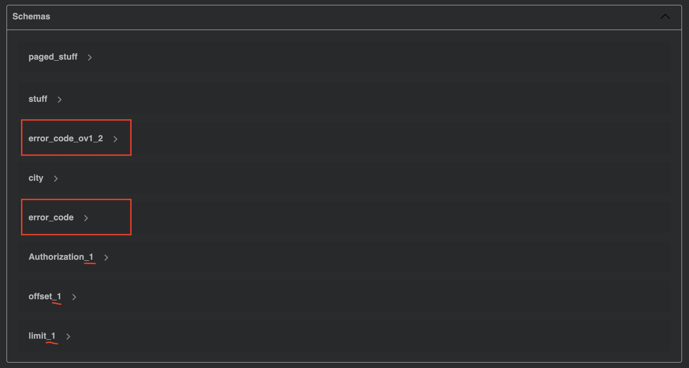

# Setup

## Build

```bash
./mvnw clean compile
```

## Results

### Positive

* This setup will be rendered correctly in VS Code using 42Crunch.vscode-openapi plugin
* openapi-generator maven plugin will successfully validate the api
* openapi-generator maven plugin will create all the files I want
* redocly lint will successfully validate the api (`npm install && npm test`)

### Negative

* openapi-generator maven plugin will create a duplicated class:
see `./target/generated-sources/openapi/src/main/java/api/model/ErrorCodeOv12DTO.java`
vs. `./target/generated-sources/openapi/src/main/java/api/model/Ov12DTO.java`
* This setup will not be rendered correctly in IntelliJ ultimate + 




